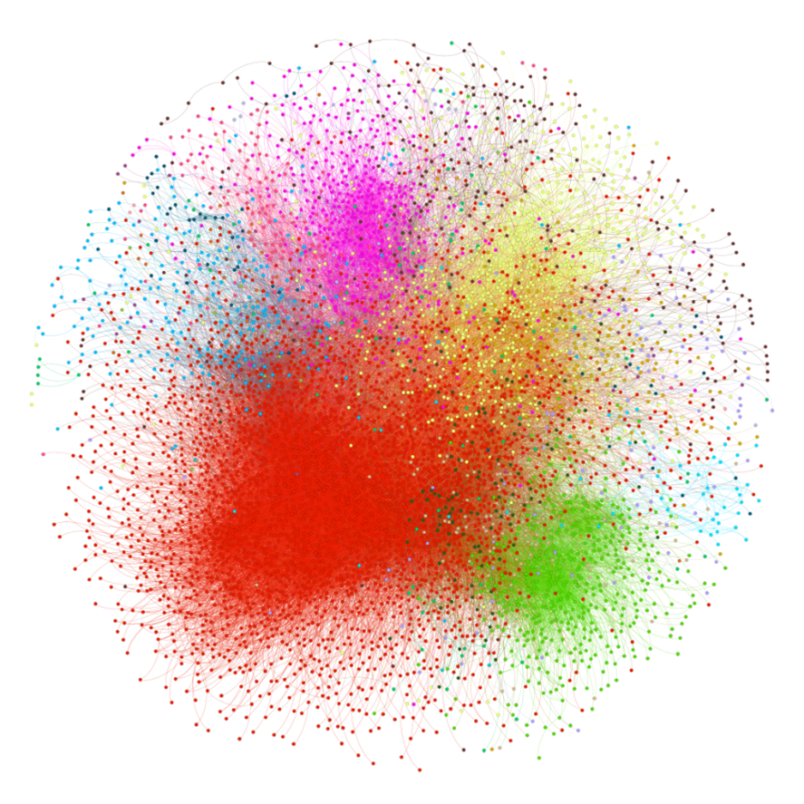
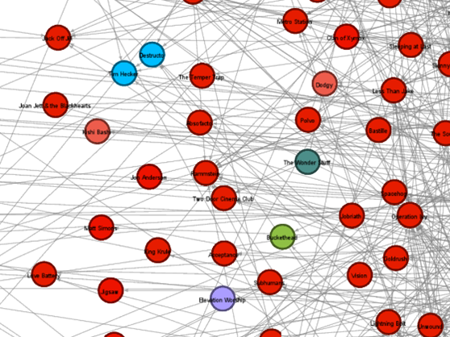
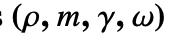
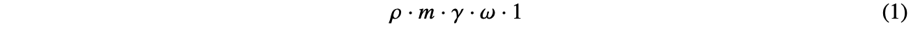
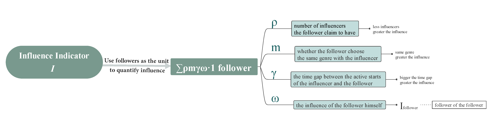
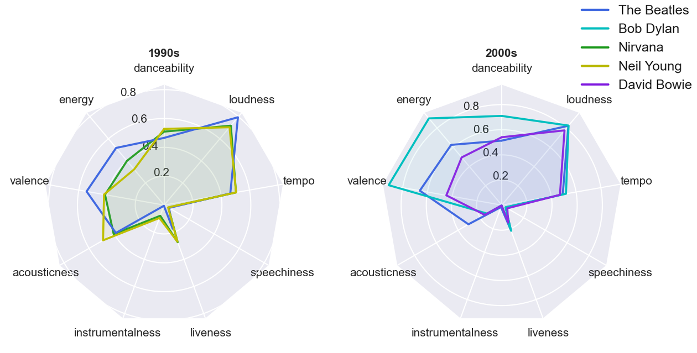

# Music Influencer Model Analysis
The repository contains source code used for ICM2021

**by Junxuan Hu, Sissi Wang, Yijia Xue**

names by the alphabetical order of the last names

The details of this project can be found in ICM2021.pdf

## Introduction

#### Problem description

Our team is asked by the Integrative Collective Music (ICM) Society to develop a model that measures musical influence, which contains two main parts: evolutionary and revolutionary. Data provided include the 5,854 artists reported influencers and musical features of 98,340 songs. Based on the data set offered, Our team will: 

1. Build a network to show the connections between influencers and followers; 
2. Develop a model to evaluate the similarities between different songs, artists, and years;
3. Compare the similarities and influences in the unit of the genre; 
4. Explore the inherent correlation of similarities and influence network; 
5.  Evaluate determinants of revolutions in the music field; 
6. Give an example of Rock/Pop music’s development in the revolutions; VII. Evaluate the effects of social, political, or technological changes.

## Model

#### Influence Network

As reported by the artists themselves as well as the opinions of industry experts, connections in form of influencer-follower were built among artists in the influence data frame. Based on these connections, a network can be built and artists’ influence indicator (I) can be measured. An example network visualization developed by the tool **Gephi** is shown below.

Influence Network Colored by Genres

Apart from the general picture, the network also shows details of in- or out-edges and neighbors of a node (see below figure). Using the details, we can develop the influence indicator for each artist.

Details of a Node

The model for the influence indicator uses the comprehensive evaluation concept. The comprehensive evaluation method aims to turn variables in different fields and with different units into a uniform variable, namely the grade. In this problem, we can easily develop an indicator in the unit of “follower(s)”. More followers indicate more influence. As a result, the problem turns into how to evaluate a follower. There are four evaluation factors for the “quality” on a follower: I. The number of influencers the follower claims to have; II. Whether the follower chooses the same genre with the influencer; III. The time gap between the influencer and the follower to become active; IV. The influence of the follower himself. These evaluation factors are in different directions, for which we can use the comprehensive evaluation measure to turn them into a uniform and easy-to-calculate unit: “follower(s)”. In other words, we give four parameters 

 to represent these four factors, and count the follower in question as

Summing up all direct followers of the influencer in this form, we get a numerical parameter as the influence indicator. Here is the mindmap for the evaluation.

#### Model for Evaluating Similarities

With the quantified data of characteristics of the music and type of vocals of a song or artist, we build a model to evaluate their similarities. Due to the high dimensions of the data, we applied Principal Component Analysis (PCA) to reduce dimensions for simplification. Based on the features of reduced data, cosine similarity was chosen to repre

In the process of building the above two basic models, we observe some interesting phenomena about genres: the influence network is more complicated, and similarities are higher among artists in the same genre. Evaluating the importance of features in different genres with the Random Forest algorithm, we found that ’Acousticness’, ’Energy’, ’Danceability’, ’Instrumentalness’, and ’Speechiness’ are the five main factors that distinguish a genre. Different genres sometimes also showed a similar developing trend, like during wartime or technology rapidly developing time, and some of them share an inherent relationship in a social context.

We also find some correlation between the two basic models: the pair of influencers and followers do show higher similarities than the others. By comparing between influencers with more than 20 followers and their followers with relatively high general similarities, we find the feature of ‘Acousticness’ is easiest to be passed down to the followers, which corresponds to the result of
what distinguishes a genre 

## Conclusion

In the Social context, music represents characteristics of an era and also in turn presents significant involvement in that time. Our work shows how the influence indicator model and the data network help investigate such topics. On the other hand, the impact of society, technology, and politics on music can also be drawn from t
